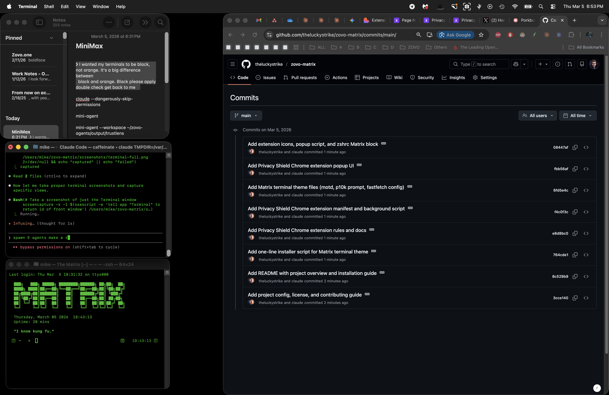
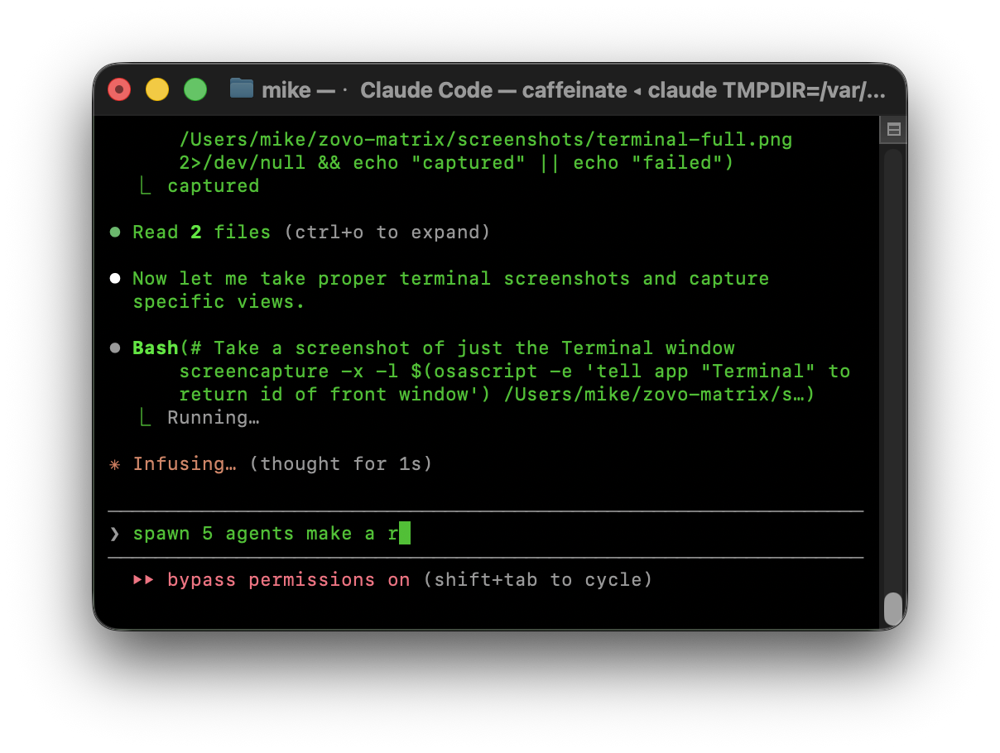

<div align="center">


<br><br>

```


  ███████╗ ██████╗ ██╗   ██╗ ██████╗       ███╗   ███╗ █████╗ ████████╗██████╗ ██╗██╗  ██╗
  ╚══███╔╝██╔═══██╗██║   ██║██╔═══██╗      ████╗ ████║██╔══██╗╚══██╔══╝██╔══██╗██║╚██╗██╔╝
    ███╔╝ ██║   ██║██║   ██║██║   ██║█████╗██╔████╔██║███████║   ██║   ██████╔╝██║ ╚███╔╝
   ███╔╝  ██║   ██║╚██╗ ██╔╝██║   ██║╚════╝██║╚██╔╝██║██╔══██║   ██║   ██╔══██╗██║ ██╔██╗
  ███████╗╚██████╔╝ ╚████╔╝ ╚██████╔╝      ██║ ╚═╝ ██║██║  ██║   ██║   ██║  ██║██║██╔╝ ██╗
  ╚══════╝ ╚═════╝   ╚═══╝   ╚═════╝       ╚═╝     ╚═╝╚═╝  ╚═╝   ╚═╝   ╚═╝  ╚═╝╚═╝╚═╝  ╚═╝


```

<h3>Transform your terminal into The Matrix.</h3>

<sub>A fully-themed Matrix terminal environment for macOS. Black backgrounds,<br>
green phosphor text, cascading code rain, and a hacker-aesthetic prompt.</sub>

</div>

<br>

<!-- ═══════════════════════════════════════════════════════════════ -->

> *"The Matrix is everywhere. It is all around us. Even now, in this very room."*
> **--- Morpheus**

<!-- ═══════════════════════════════════════════════════════════════ -->

<br>

## Preview

<div align="center">



<sub><b>Full desktop with the Matrix terminal environment active</b></sub>

</div>

<br>

```
╔══════════════════════════════════════════════════════════════════╗
║                                                                  ║
║   > SYSTEM INITIALIZED                                           ║
║   > LOADING MATRIX ENVIRONMENT...                                ║
║   > ALL MODULES ONLINE                                           ║
║                                                                  ║
╚══════════════════════════════════════════════════════════════════╝
```

<!-- ═══════════════════════════════════════════════════════════════ -->

> *"I know kung fu."*
> **--- Neo**

<!-- ═══════════════════════════════════════════════════════════════ -->

<br>

## Features

> ```
> [SIGNAL INTERCEPT] >> Decoding feature manifest...
> [STATUS] >> TRANSMISSION ACTIVE
> ```

<table>
<tr><td>

**Black background, Matrix green text** --- Full terminal color scheme built around `#00FF00` on pure black. Every pixel serves the illusion.

**Powerlevel10k prompt** --- Custom green hacker-aesthetic prompt. You will feel like you are sitting aboard the Nebuchadnezzar.

**Matrix MOTD welcome screen** --- Randomized quotes from The Matrix greet every new session. The Oracle has many things to say.

**Syntax highlighting in green** --- zsh-syntax-highlighting themed to the Matrix palette. Your code glows.

**Autosuggestions in dim green** --- Subtle inline completions that stay on-brand. The Matrix whispers what comes next.

**fastfetch system info** --- Green-themed system dashboard. Know your construct.

**cmatrix rain animation** --- Classic cascading Matrix code rain. One command away from digital rain.

**Utility commands** --- Purpose-built tools: `neo`, `decode`, `scan`, `tree-scan`. Your operator toolkit.

**Privacy Shield Chrome extension** --- Browser-side privacy hardening. Because even The One needs to stay hidden.

</td></tr>
</table>

<br>

```
╠══════════════════════════════════════════════════════════════════╣
```

<!-- ═══════════════════════════════════════════════════════════════ -->

> *"Unfortunately, no one can be told what the Matrix is. You have to see it for yourself."*
> **--- Morpheus**

<!-- ═══════════════════════════════════════════════════════════════ -->

<br>

## Screenshots

<div align="center">

<table>
<tr>
<td align="center" width="50%">

<br><sub><b>Terminal Window Close-Up</b></sub>
</td>
<td align="center" width="50%">

<br><sub><b>MOTD Welcome Screen</b></sub>
</td>
</tr>
<tr>
<td align="center" width="50%">

<br><sub><b>Fastfetch System Info</b></sub>
</td>
<td align="center" width="50%">

<br><sub><b>cmatrix Digital Rain</b></sub>
</td>
</tr>
</table>

</div>

<br>

```
╠══════════════════════════════════════════════════════════════════╣
```

<!-- ═══════════════════════════════════════════════════════════════ -->

> *"There is no spoon."*
> **--- Spoon Boy**

<!-- ═══════════════════════════════════════════════════════════════ -->

<br>

## Quick Install

> ```
> [INCOMING TRANSMISSION]
> [SOURCE] >> Operator
> [MESSAGE] >> "Tank, load the jump program."
> ```

```bash
git clone https://github.com/theluckystrike/zovo-matrix.git
cd zovo-matrix
chmod +x install.sh
./install.sh
```

The installer will back up your existing configuration before making any changes. Your previous reality is preserved.

<br>

```
╠══════════════════════════════════════════════════════════════════╣
```

<!-- ═══════════════════════════════════════════════════════════════ -->

> *"I can only show you the door. You're the one that has to walk through it."*
> **--- Morpheus**

<!-- ═══════════════════════════════════════════════════════════════ -->

<br>

## Commands

> ```
> [OPERATOR CONSOLE] >> Loading available programs...
> [ACCESS LEVEL] >> ROOT
> ```

```
 COMMAND         DESCRIPTION
 ─────────────── ──────────────────────────────────────────────────
 matrix          Launch the Matrix rain animation (cmatrix)
 neo             Open the system dashboard
 decode          Decode-style text animation effect
 scan            Network/system scan with Matrix-styled output
 tree-scan       Directory tree with green Matrix formatting
 fastfetch       Display system info in green-themed layout
```

<br>

```
╠══════════════════════════════════════════════════════════════════╣
```

<!-- ═══════════════════════════════════════════════════════════════ -->

> *"Guns. Lots of guns."*
> **--- Neo**

<!-- ═══════════════════════════════════════════════════════════════ -->

<br>

## Chrome Extension --- Privacy Shield

The repository includes **Privacy Shield**, a lightweight Chrome extension that hardens your browser's privacy settings. Because you cannot fight the system if the system is watching you.

> ```
> [PRIVACY MODULE] >> Installing countermeasures...
> [STATUS] >> STEALTH MODE ENGAGED
> ```

1. Open Chrome and navigate to `chrome://extensions`
2. Enable **Developer mode** (toggle in the top-right corner)
3. Click **Load unpacked**
4. Select the `chrome-extension/` directory from this repository

Privacy Shield blocks common tracking mechanisms and integrates visually with the Matrix green theme.

<br>

```
╠══════════════════════════════════════════════════════════════════╣
```

<br>

## Requirements

> ```
> [CONSTRUCT PARAMETERS] >> Verifying system compatibility...
> ```

```
 DEPENDENCY       PURPOSE
 ──────────────── ────────────────────────────────────────
 macOS            Target platform
 zsh              Shell (default on macOS)
 Oh My Zsh        Plugin and theme framework
 Powerlevel10k    Prompt theme
 Homebrew         Package manager for dependencies
```

The install script will check for these and guide you through any missing setup.

<br>

```
╠══════════════════════════════════════════════════════════════════╣
```

<!-- ═══════════════════════════════════════════════════════════════ -->

> *"The Matrix has you..."*

<!-- ═══════════════════════════════════════════════════════════════ -->

<br>

## Contributing

Contributions are welcome. To jack in:

1. Fork the repository
2. Create a feature branch (`git checkout -b feature/your-feature`)
3. Commit your changes (`git commit -m "Add your feature"`)
4. Push to your branch (`git push origin feature/your-feature`)
5. Open a Pull Request

Please ensure your changes are consistent with the Matrix green theme and follow the existing code style. Stay in the construct.

<br>

```
╠══════════════════════════════════════════════════════════════════╣
```

<br>

<div align="center">

## Built by Zovo

**[zovo.one](https://zovo.one)** --- Building tools for developers who care about privacy, performance, and beautiful interfaces.

This project is part of the Zovo open-source ecosystem.

<br>

[](https://zovo.one)
[](https://github.com/theluckystrike)

<br>

```
╔══════════════════════════════════════════════════════════════════╗
║                                                                  ║
║                      ZOVO  //  zovo.one                          ║
║            Privacy. Performance. Beautiful Interfaces.           ║
║                                                                  ║
╚══════════════════════════════════════════════════════════════════╝
```

</div>

<br>

## License

This project is licensed under the **MIT License**. See [LICENSE](LICENSE) for details.

<br>

---

<div align="center">

```
     ╽  ╿  ╽  ╿  ╽  ╿  ╽  ╿  ╽  ╿
     0  1  1  0  1  0  0  1  1  0
     ╽  ╿  ╽  ╿  ╽  ╿  ╽  ╿  ╽  ╿
```

<sub><i>"Remember... all I'm offering is the truth. Nothing more."</i></sub>

<sub>--- Morpheus</sub>

</div>
