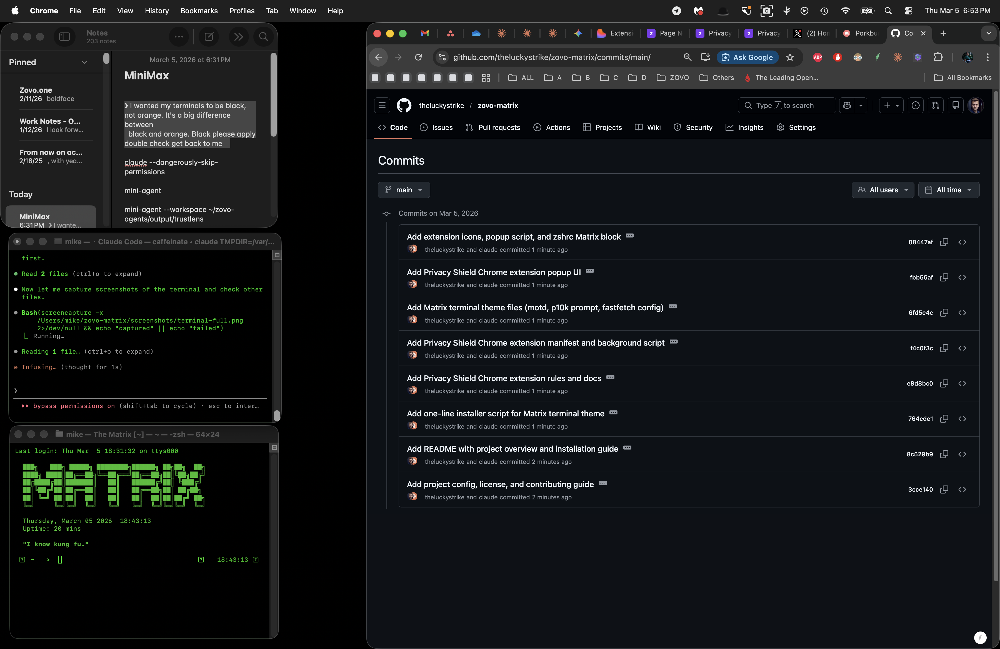
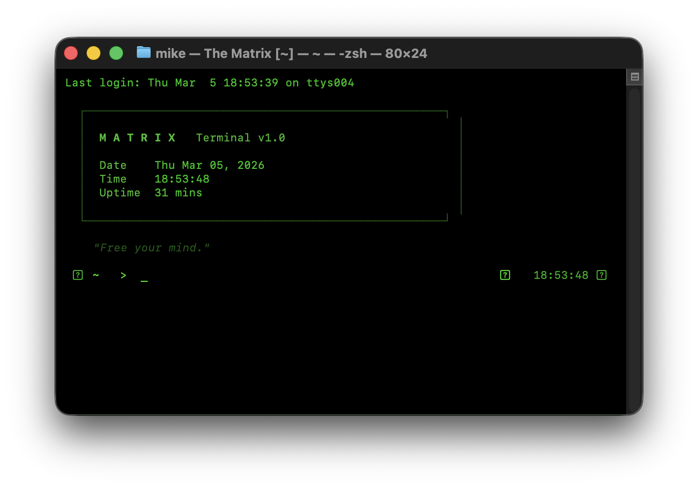
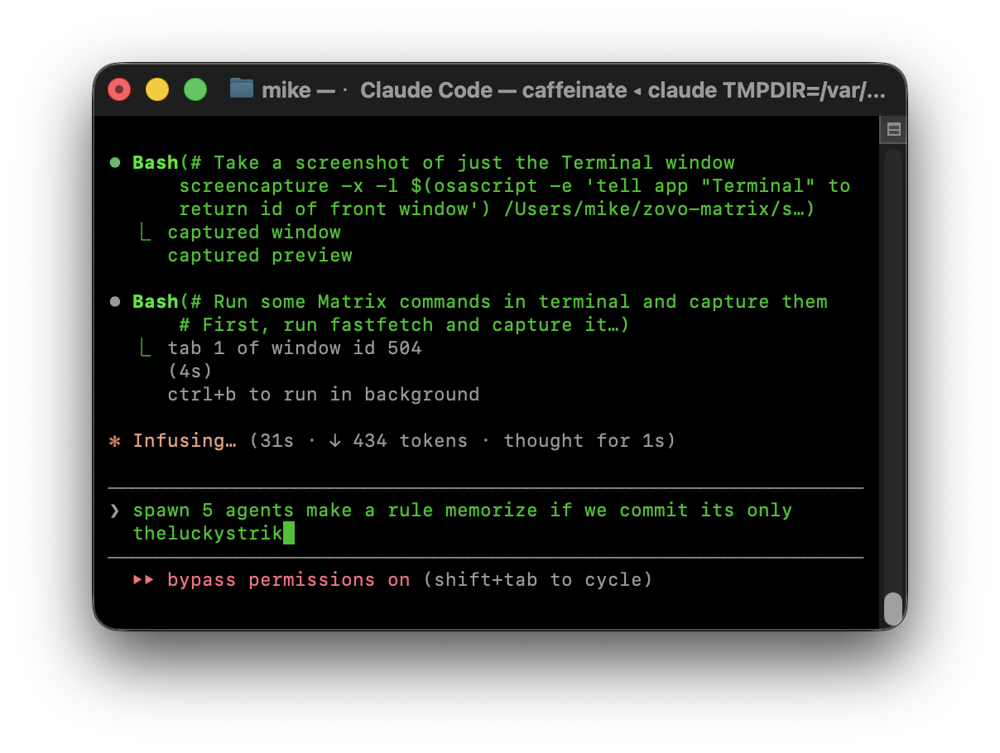
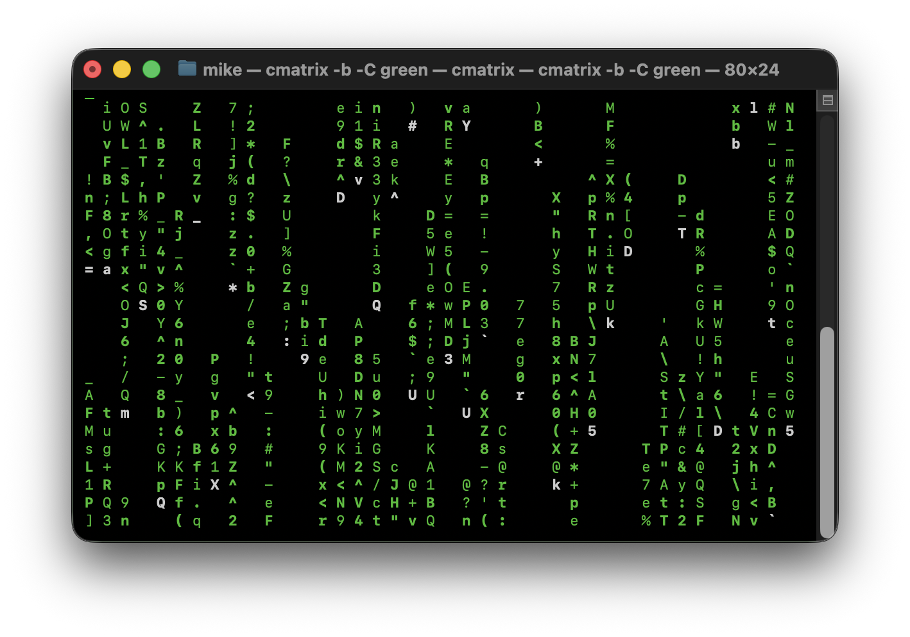

# ZOVO-MATRIX

<p align="center">
  
  
  
</p>

A Matrix-themed terminal environment for macOS and a privacy-focused Chrome extension, packaged together in one repository.

The terminal side rewires your zsh shell into a green-on-black hacker aesthetic with a custom Powerlevel10k prompt, syntax highlighting, MOTD, and a handful of utility commands. The browser side ships a Manifest V3 Chrome extension called **Privacy Shield** that blocks trackers, analytics, and fingerprinting requests before they leave your machine.

```
  ███████╗ ██████╗ ██╗   ██╗ ██████╗       ███╗   ███╗ █████╗ ████████╗██████╗ ██╗██╗  ██╗
  ╚══███╔╝██╔═══██╗██║   ██║██╔═══██╗      ████╗ ████║██╔══██╗╚══██╔══╝██╔══██╗██║╚██╗██╔╝
    ███╔╝ ██║   ██║██║   ██║██║   ██║█████╗██╔████╔██║███████║   ██║   ██████╔╝██║ ╚███╔╝
   ███╔╝  ██║   ██║╚██╗ ██╔╝██║   ██║╚════╝██║╚██╔╝██║██╔══██║   ██║   ██╔══██╗██║ ██╔██╗
  ███████╗╚██████╔╝ ╚████╔╝ ╚██████╔╝      ██║ ╚═╝ ██║██║  ██║   ██║   ██║  ██║██║██╔╝ ██╗
  ╚══════╝ ╚═════╝   ╚═══╝   ╚═════╝       ╚═╝     ╚═╝╚═╝  ╚═╝   ╚═╝   ╚═╝  ╚═╝╚═╝╚═╝  ╚═╝
```

## What's Included

### 🖥️ Terminal Theme

- Sets Terminal.app to black background with `#00FF00` green text and cursor
- Installs a custom Powerlevel10k prompt tuned to the Matrix palette (lean style, no powerline arrows, green directory/git/status segments)
- Applies green syntax highlighting and dim green autosuggestions via the standard zsh plugins
- Shows a Matrix MOTD on every new shell session with randomized quotes, date, time, and uptime inside an ASCII box topped by animated rain characters
- Configures fastfetch with a green-only color scheme for system info display
- Themes LS_COLORS, LSCOLORS, and GREP_COLOR to match

### 🛡️ Privacy Shield (Chrome Extension)

- Manifest V3 extension using `declarativeNetRequest` to block tracking and analytics domains
- Covers Google Analytics, Google Tag Manager, DoubleClick, Facebook pixel, Hotjar, Mixpanel, Segment, Amplitude, FingerprintJS, Bing UET, LinkedIn Insight, Snapchat, Sentry, New Relic, FullStory, Microsoft Clarity, and Google AdSense
- Shows a per-tab and per-session blocked count in the popup
- Toggle on/off from the popup without uninstalling
- No data collection, no remote calls, everything runs locally

## Requirements

```
macOS            Target platform
zsh              Default shell on macOS
Oh My Zsh        Plugin and theme framework
Powerlevel10k    Prompt engine (brew install powerlevel10k or git clone into custom/themes)
Homebrew         Package manager
```

The installer will also pull in cmatrix, fastfetch, zsh-syntax-highlighting, zsh-autosuggestions, and tree via Homebrew if they are not already present.

## Installation

```sh
git clone https://github.com/theluckystrike/zovo-matrix.git
cd zovo-matrix
chmod +x install.sh
./install.sh
```

The installer backs up your existing `.zshrc`, `.p10k.zsh`, and fastfetch config to `~/.zovo-matrix-backup` before writing anything. On macOS it also sets Terminal.app colors via osascript.

To remove everything and restore your backups, run:

```sh
./install.sh --uninstall
```

or use the standalone uninstaller:

```sh
chmod +x uninstall.sh
./uninstall.sh
```

## Custom Commands

After installation, the following commands are available in any new shell session:

| Command | Description |
|---------|-------------|
| `matrix` | Launch cmatrix with green rain |
| `neo` | System dashboard (host, OS, shell, CPU, memory, disk, battery, IP, uptime) |
| `decode TEXT` | Typewriter-style text animation in green |
| `scan [dir]` | Directory summary (file count, dir count, total size) |
| `tree-scan` | Green-tinted tree view (depth 2) |
| `red-pill` | Run fastfetch |
| `wake-up-neo` | Classic "Wake up, Neo..." typewriter sequence |

## Installing the Chrome Extension

1. Open Chrome and go to `chrome://extensions`
2. Turn on **Developer mode** in the top right
3. Click **Load unpacked**
4. Select the `chrome-extension/` directory from this repository

The extension icon will appear in your toolbar. Click it to see blocked request counts and to toggle protection on or off.

## Screenshots

<p align="center">
  
</p>
<p align="center">
  
</p>
<p align="center">
  
</p>
<p align="center">
  
</p>

## Project Structure

```
zovo-matrix/
├── install.sh                  # Installer (also handles --uninstall)
├── uninstall.sh                # Standalone uninstaller
├── README.md                   # This file
├── LICENSE                     # MIT License
├── CONTRIBUTING.md             # Contribution guidelines
├── package.json                # Project metadata
├── theme/
│   ├── p10k-matrix.zsh         # Powerlevel10k config
│   ├── matrix-motd.sh          # MOTD script sourced on shell startup
│   ├── zshrc-matrix-block.sh  # Block appended to .zshrc (aliases, functions, highlighting)
│   └── fastfetch-config.jsonc # Fastfetch color and module config
├── chrome-extension/
│   ├── manifest.json           # Manifest V3 extension definition
│   ├── background.js           # Service worker for request counting and toggle
│   ├── popup.html              # Extension popup HTML
│   ├── popup.js                # Extension popup JavaScript
│   ├── popup.css               # Extension popup styles
│   ├── rules.json              # Declarative net request blocking rules
│   └── icons/                  # Extension icons (SVG)
└── screenshots/                 # Terminal and extension screenshots
```

## Contributing

1. Fork the repository
2. Create a feature branch (`git checkout -b feature/your-feature`)
3. Commit your changes
4. Push and open a pull request

Keep everything green-on-black. Follow the existing code style.

## License

MIT. See [LICENSE](LICENSE) for the full text.

---

Built at [zovo.one](https://zovo.one) by [theluckystrike](https://github.com/theluckystrike)
